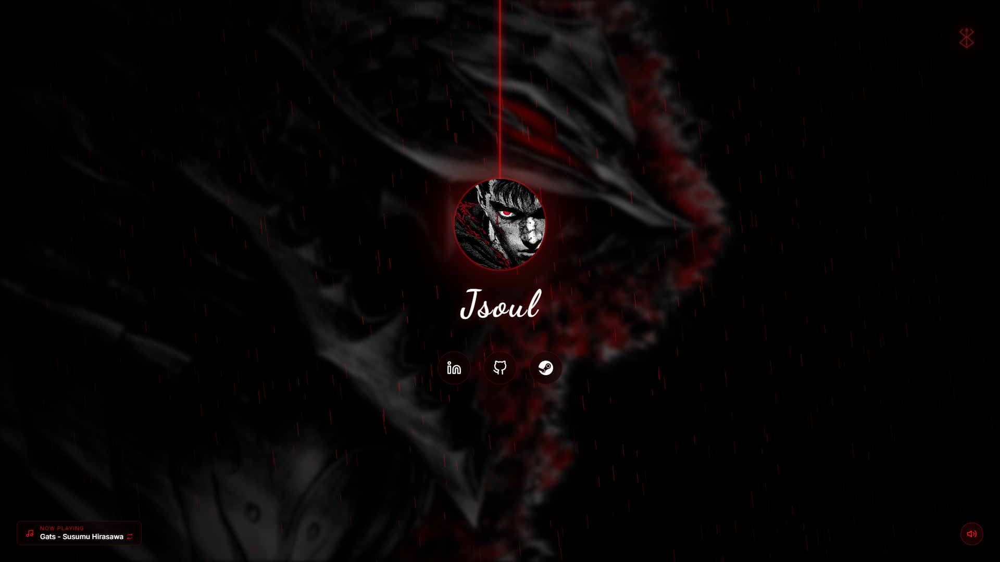

# 🩸 Jsoul

> A dark, neon-infused, Berserk-themed personal profile page built with HTML, CSS, and Vanilla JavaScript.

## Preview

## Built With
- **HTML5**: Semantic structure and layout.
- **CSS3**: Custom CSS Variables, Flexbox, Keyframe Animations, SVG styling, and hardware-accelerated transitions.
- **Vanilla JavaScript**: DOM manipulation, audio playback handling, and custom typing/glitching text effects.

## Assets & Attribution
- **Avatar & Background**: *Berserk* by Kentaro Miura.
- **Music**: *Gats* composed by Susumu Hirasawa.
- **Icons**: Custom SVGs and Feather Icons.
